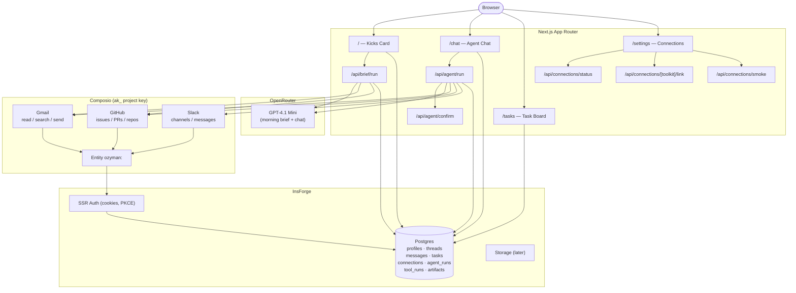

# Ozyman

**Personal Operator OS** — a private career + life **operator buddy**: Gmail, GitHub, tasks, Top-3 kicks, chat with tools, confirm before irreversible actions.

| | |
|--|--|
| **Product** | Operate *today* in accounts you already have |
| **Not this** | Job boards (**Disha**), FSRS study (**Scholar-Loop**), creative ideation (**IdeaForge**) |
| **Stack** | Next.js 15 · InsForge (auth/Postgres) · Composio · OpenRouter |
| **InsForge project** | `ozyman` · ap-southeast · `https://sik8rdbp.ap-southeast.insforge.app` |

## Docs (start here)

| Doc | Purpose |
|-----|---------|
| **[docs/STATUS.md](./docs/STATUS.md)** | **Handoff** — what works, known gaps, resume checklist |
| [docs/portfolio-product-boundaries.md](./docs/portfolio-product-boundaries.md) | Ozyman vs Disha vs Scholar-Loop vs IdeaForge |
| [docs/design-ozyman-personal-operator-os.md](./docs/design-ozyman-personal-operator-os.md) | Full design (architecture, schema, PR plan) |
| [docs/setup.md](./docs/setup.md) | Env matrix, secrets, Composio project key, migrations |
| [`.env.example`](./.env.example) | Env template (copy to `.env.local`) |
| [AGENTS.md](./AGENTS.md) | Guidance for coding agents |

## Quick start

```bash
cp .env.example .env.local
# Fill NEXT_PUBLIC_INSFORGE_*, OPENROUTER_*, COMPOSIO_API_KEY (prefer ak_ project key)
# See docs/setup.md

npm install
npm run dev
```

Open [http://localhost:3000](http://localhost:3000). Sign in with **Google OAuth** (preferred).

| Command | Purpose |
|---------|---------|
| `npm run dev` | Local Next.js (default port 3000) |
| `npm run build` | Production build |
| `npm run typecheck` | `tsc --noEmit` |
| `npm start` | Serve production build |

## App map

| Route | What |
|-------|------|
| `/` | Home — greeting + **Top 3 Kicks** (Generate/Refresh) |
| `/chat` | Companion chat + tools + confirm UI |
| `/tasks` | Open / proposed tasks |
| `/settings` | Account, sign out, connected apps, **Manage apps** (Link/Verify) |
| `/connections` | Redirects → `/settings` |

## Architecture



## Composio

| | |
|--|--|
| **UI** | Settings → Manage apps |
| **Code** | `lib/composio/*` |
| **Key** | Project `ak_…` for multi-user/cloud; never `NEXT_PUBLIC_*` |
| **Entity** | `ozyman:<insforge_user_id>` in project mode (KD 17) |

## Database

SQL under [`migrations/`](./migrations/):

```bash
npx @insforge/cli db migrations up --all
```

Requires linked project (`.insforge/project.json` — gitignored).

## Do not commit

- Any `.env*` except `.env.example`
- `.insforge/` (CLI credentials)
- Live API keys

## Sibling projects

| Repo | Role |
|------|------|
| `~/Projects/Disha` | Job market intelligence |
| `~/Projects/Scholar-Loop` | FSRS learn/quiz digests |
| `~/Projects/IdeaForge` | Creative synthesis (scaffold) |
