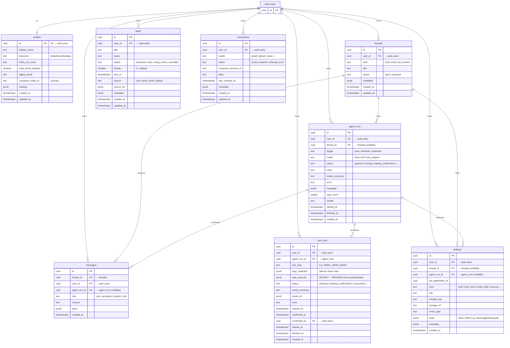
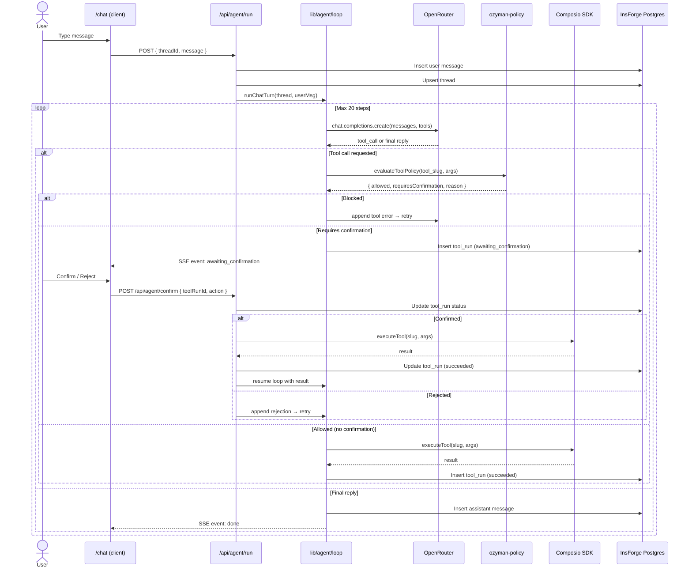
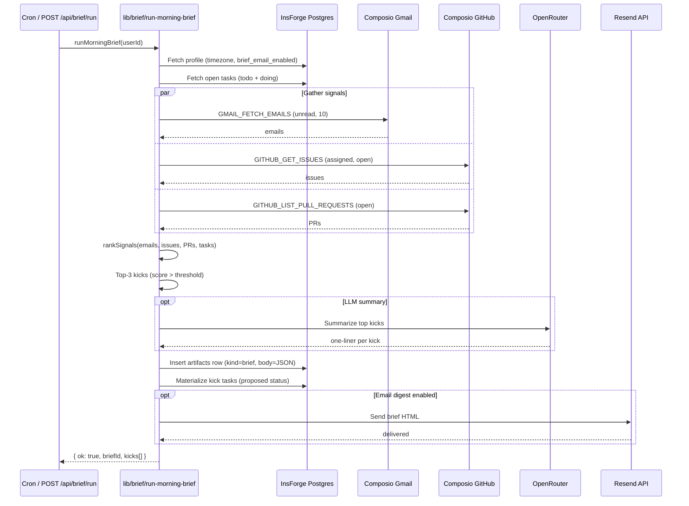
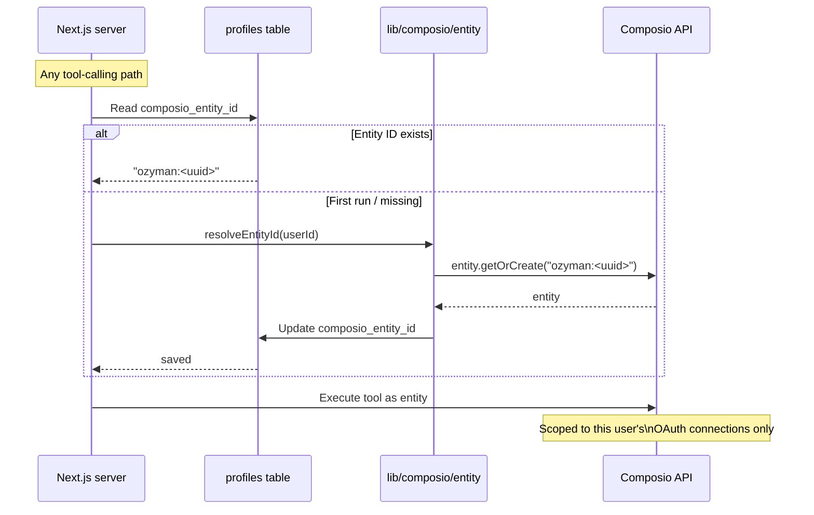

# Architecture

Visual reference for Ozyman's data model and key flows.

## Database ERD



## Key constraints

| Table | Column | Restriction |
|-------|--------|-------------|
| `tool_runs` | `args_execute` | `REVOKE SELECT` from `authenticated`/`anon` — secret payloads only via admin client or `tool_runs_public` view |
| `tool_runs_public` | *(view)* | `security_invoker` — underlying RLS applies; excludes `args_execute` |
| `connections` | `(user_id, toolkit)` | `UNIQUE` — one connection per toolkit per user |
| `messages` | `agent_run_id` | Deferred FK (added in PR-03 migration); dual-parent RLS guard |
| `artifacts` | `body` | Inline JSON payload (added in brief-body migration) |
| Storage | `artifacts` bucket | Path-scoped RESTRICTIVE policies: `/{user_id}/...` only |

## Chat message flow



## Morning brief flow



## Composio entity resolution



## RLS pattern

Every user-owned table follows the same pattern:

```sql
-- All queries use (SELECT auth.uid()) to avoid recursion
USING  (user_id = (SELECT auth.uid()))   -- read / update / delete
WITH CHECK (user_id = (SELECT auth.uid())) -- insert / update
```

Tables with dual-parent ownership (messages, tool_runs, artifacts) add an `EXISTS` subquery to verify the parent row also belongs to the same user:

```sql
WITH CHECK (
  user_id = (SELECT auth.uid())
  AND EXISTS (
    SELECT 1 FROM public.threads t
    WHERE t.id = thread_id
      AND t.user_id = (SELECT auth.uid())
  )
)
```
