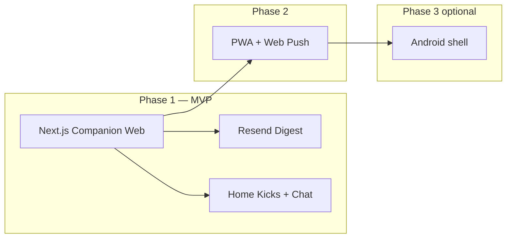
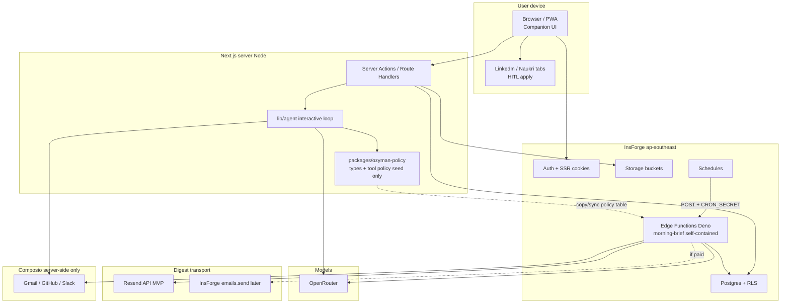
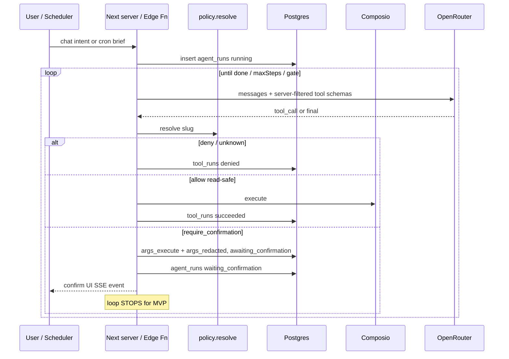
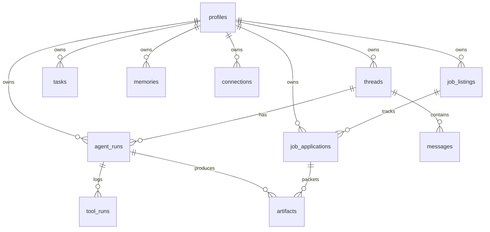

# Ozyman — Personal Operator OS

| Field | Value |
|-------|--------|
| **Document** | Design Specification |
| **Author** | TBD |
| **Date** | 2026-07-17 |
| **Status** | Draft (rev 4 — GitHub scope, safe views, bootstrap email, confirm sequence) |
| **Project** | `ozyman` (InsForge) |
| **API base** | `https://sik8rdbp.ap-southeast.insforge.app` |
| **Region** | ap-southeast (Singapore) |
| **Project ID** | `0d17fef9-bbd7-4d56-82cd-d04e8ee1afc5` |
| **Repo** | `/home/anmol/Projects/Ozyman` (scaffold only) |
| **Billing note** | InsForge plan is currently **free** (verified) — digests use **Resend-first** |

---

## Overview

**Ozyman** is a **Personal Operator OS** with a **KickerAI-shaped personality**: a private career + life **operator buddy** that does real work across the owner's accounts, keeps durable memory, and shows up proactively — not a cold chat-only copilot and not a health tracker clone.

It is the *operator surface*. **Scholar-Loop** remains a separate *learning companion* (FSRS / study digests). Ozyman may later *kick* a study session via deep-link; v1 does **not** merge codebases.

This document locks product and delivery choices, defines a Kicker-inspired UX north star, a capability matrix with honest automation levels and safety gates, architecture on **InsForge** (Postgres, auth, storage, edge functions, schedules, AI via OpenRouter) plus **Composio** tools, a durable data model, the **Morning Brief / Top-3 Kicks** as the first killer loop, security/RLS, and a phased PR plan.

**Recommendation in one line:** ship a **mobile-friendly Next.js companion web app** (InsForge SSR auth + “today’s kicks” home + chat), digests via **Resend** on free-plan InsForge, progressive PWA/push later; automate read/draft aggressively; require explicit, friendly confirms for send-email and job apply.

---

## Background & Motivation

### Why now

Personal operator workflows are fragmented across Gmail, GitHub, Slack, LinkedIn/Naukri job hunts, and ad-hoc tasks. The user is an AI engineer with prior art (`nexus_bot`, `CodexEngine`, `Scholar-Loop`) and wants a surface that *does work*, remembers context, and feels like a buddy in their corner — similar in *personality and utility patterns* to **KickerAI** (`usekicker.com` / `com.kickerai.app`), adapted to career/ops rather than health-only.

### Current state

| Asset | State |
|-------|--------|
| `/home/anmol/Projects/Ozyman` | Blank scaffold: `AGENTS.md`, `.env.local`, `.insforge/project.json`, `.gitignore` |
| InsForge project **ozyman** | Linked (ap-southeast, appkey `sik8rdbp`); **no tables/buckets/functions**; OAuth providers **GitHub + Google** already enabled on project |
| InsForge billing | **free** — custom `insforge.emails.send` unavailable without paid upgrade |
| OpenRouter | `OPENROUTER_API_KEY` not yet configured (run `npx @insforge/cli ai setup`) |
| Composio | ACTIVE in **CLI consumer context**: GitHub, Gmail, Slack; Notion EXPIRED (author/CLI snapshot — re-check before implement) |
| App code / schema / UI | None yet |
| Scholar-Loop | Separate product/repo — stays separate; user already used **Resend** there |

### Pain points the OS must solve

1. **Context switching** every morning across mail, GH, jobs, tasks.
2. **No durable operator memory** — chat UIs forget preferences and application history.
3. **Unsafe automation** — send-email and job apply need draft-first + confirm.
4. **Fragile job-board APIs** — LinkedIn/Naukri apply is not a clean API; design honestly.
5. **Delivery ambiguity** — web vs email vs Android resolved with a phased surface strategy.
6. **Cold productivity bots** — user wants a companion that prioritizes Top 3, nudges gently, and celebrates wins (Kicker pattern).

### Product thesis

> **Ozyman** = operator buddy (email ops, GH, tasks, morning/evening Top-3 kicks, confirm-gated actions).  
> **Not** job-market intelligence (**Disha** · `~/Projects/Disha`), **not** FSRS digests (**Scholar-Loop** · `~/Projects/Scholar-Loop`), **not** creative synthesis (**IdeaForge** · `~/Projects/IdeaForge`).  
> Personality model inspired by KickerAI; domain is **ops + career-sidekick**, not health and not job-board search.  
> Integrate siblings via deep-link/export only — never one monolith.  
> **Canonical split:** [portfolio-product-boundaries.md](./portfolio-product-boundaries.md) (same file in all four project `docs/` folders).

---

## Product Personality / UX North Star (KickerAI-inspired)

Ozyman is **not** “another corporate AI copilot.” Personality and utility patterns borrow from KickerAI’s *buddy* positioning, remapped to operator life.

### Brand voice

| Trait | Ozyman expression |
|-------|-------------------|
| **Little AI buddy** | Warm, short, human; can use light humor; never corporate-jargon walls |
| **In your corner** | Job search rough → empathy + one concrete next kick, not hustle shame |
| **Proactive** | Notices PRs waiting, due tasks, stale applications — surfaces them unprompted in brief/nudges |
| **Top-3 prioritization** | When overwhelmed, always picks **3 kicks** that matter today |
| **Gentle** | No guilt trips, no streak shaming, no “you failed your routine” |
| **Celebrates wins** | Merged PR, application sent, inbox zero-ish, task cleared → acknowledge |
| **Remembers** | Durable memories + “I know you prefer draft-only email” |
| **Mobile companion feel** | Large tap targets, home card for kicks, chat that feels personal; email as pager |

**Working persona name:** **Ozyman** (the product *is* the buddy). Optional later: user-set nickname in `profiles.settings.persona_name`.

### Tone rules (system prompt + UI copy)

**Do:**

- Lead with care + clarity: “Morning. Here’s what actually matters today.”
- Use second person, short paragraphs, plain English.
- Frame gated actions as a friend asking: “Want me to send this reply?” not “CONFIRM TRANSACTION.”
- Celebrate specifically: “PR #42 merged — nice.”
- On failure: soft + actionable (“Gmail was flaky; here’s tasks + GH only.”).

**Don’t (anti-patterns):**

| Anti-pattern | Why banned |
|--------------|------------|
| Corporate copilot / enterprise dashboard tone | Kills buddy bond |
| Guilt, FOMO, toxic hustle | Opposes “always in your corner” |
| Spammy multi-nudge loops | Trust destruction |
| Walls of unread digests without prioritization | Overwhelm; violates Top-3 |
| Silent irreversible actions | Safety + trust |
| Streak shame / red angry empty states | ADHD-unfriendly |
| Pretending to be a therapist or doctor | Out of domain |

### Proactive behavior rules

1. **Morning check-in** (scheduled): Top 3 kicks + context sections (collapsed).
2. **Evening wrap** (Phase 1.5 / optional MVP-B+): what moved, wins, open loops for tomorrow.
3. **Quiet hours** (`profiles.settings.quiet_hours`): no email digests / push in window (default 22:00–07:00 IST).
4. **Nudge budget:** max **1 proactive email/day** (the brief) in MVP; in-app can refresh.
5. **Context-adaptive:** if user was active late (optional signal later), soften morning tone and shrink kicks; if job pipeline stagnant > N days, one gentle kick only.
6. **Confirms stay friendly:** copy uses buddy voice; UX still requires explicit button press.

### Utility patterns borrowed from Kicker

| Kicker pattern | Ozyman adaptation |
|----------------|-------------------|
| Health bestie | Operator / career sidekick |
| Diet/sleep/exercise check-ins | Morning brief + evening wrap (email, GH, tasks, jobs) |
| Top 3 things today | **Top 3 kicks** on home + in email digest |
| Gentle nudges | Confirm-gated “want me to…?” + optional in-app nudge chips |
| Connect apps you already use | Gmail, GitHub, Slack (+ Calendar when linked); job boards HITL |
| Celebrates small wins | Win chips on home / evening wrap |
| Always in your corner | Supportive job-search tone; no toxic hustle |
| Mobile companion | Web-first, mobile-first CSS, PWA Phase 2; Android shell Phase 3 |
| Character grows with you | `memories` + settings prefs; optional persona polish later |

### What we deliberately do **not** copy

| Kicker (or clone) element | Ozyman stance |
|---------------------------|---------------|
| Primary **health/medical** domain (Oura, diet, workouts as core) | Out of v1 scope; optional wellness *skill* much later |
| Wearable-first product | Not required |
| Guilt/streak mechanics if any exist in category peers | Explicitly avoided |
| Pure chat without home prioritization | We ship **Today’s Kicks** card + companion chat |
| Merging a second product’s domain (study FSRS) | Scholar-Loop stays separate |

### UX information architecture (companion, not enterprise)

```
/                     → Home: greeting + Today's Top 3 Kicks + wins strip + pending confirms
/chat or /inbox       → Companion chat (threads list)
/t/[threadId]         → Conversation + tool timeline (friendly labels)
/brief/[id]           → Morning/evening check-in detail
/tasks                → Tasks (ADHD-friendly list, not Jira)
/jobs                 → Job pipeline board
/jobs/[id]            → Application packet
/connections          → Connected apps (quiet status, re-link)
/settings             → Timezone, quiet hours, voice prefs, safety toggles
/confirm/[toolRunId]  → “Want me to do this?” confirm surface
```

**Home card anatomy (“Today’s Kicks”):**

1. Greeting line (time-of-day + name).
2. **Kick 1–3:** each has title, why it matters (1 line), primary action (`Open`, `Draft reply`, `Mark done`, `Kick me` → starts chat/agent with that intent). If no brief yet → empty state (see **Home empty states**): no fake kicks.
3. Collapsed “Also on your plate” (email/GH counts) when brief exists.
4. Pending confirms badge (when any `awaiting_confirmation`).
5. Small wins since yesterday (if any).

---

## Goals & Non-Goals

### Goals (v1)

1. **Companion web app** (Next.js + InsForge SSR auth) — mobile-friendly home kicks + chat.
2. **Composio-backed tools** for Gmail, GitHub, Slack with visible connection status + re-link.
3. **Durable memory + artifacts** with full `tool_runs` audit log.
4. **Morning Brief / Top-3 Kicks** as first killer loop → in-app + **Resend** email digest.
5. **Tasks** first-class (manual + proposed from brief).
6. **Job applications** draft-first, confirm/mark-applied, status tracking.
7. **Safety gates** for irreversible actions with buddy-toned confirms.
8. **Scholar-Loop boundary** respected; optional later “kick study” deep-link only.
9. **Kicker-shaped personality** in system prompts, brief copy, and UI.

### Non-Goals (v1)

- Native Android/iOS app (Phase 3 shell only).
- Absorbing Scholar-Loop FSRS / study cards.
- Fully autonomous LinkedIn/Naukri browser automation (ToS risk).
- Multi-tenant SaaS productization (billing, teams).
- Replacing IDE/coding agents.
- Primary health/medical companion features.
- Real-time multiplayer UI.

---

## Delivery Surface Decision

### Options compared

| Surface | Pros | Cons | Fit |
|---------|------|------|-----|
| **Web app (Next.js)** | Fastest on InsForge; SSR; full companion UI | Needs browser | Primary |
| **Email-only** | Zero install; Scholar-Loop habit | Bad for confirms/audit | Pager only |
| **Android native** | Best push | High cost | Phase 3 |
| **PWA + web push** | Companion install feel | Push quirks | Phase 2 |
| **SMS / WhatsApp** | High open rates in India | Complex; weak rich UI | Later optional |

### Recommendation (locked)

**Primary: Web app (Next.js App Router)** — mobile-first companion UI, deploy Vercel or InsForge website deploy; backend InsForge.

**Notifications (phased):**

| Phase | Channel | Mechanism |
|-------|---------|-----------|
| **1 (MVP)** | In-app + **email digests** | **Resend-first** (`DIGEST_EMAIL_PROVIDER=resend`); InsForge `emails.send` only if/when plan upgraded (`insforge`) |
| **2** | PWA + **web push** | SW + VAPID + `push_subscriptions` |
| **3** | Android | Capacitor/TWA shell — not a rewrite |

**Rationale:** Web is the OS; email is the pager; push enhances the companion; native is optional. Jaipur → Singapore RTT is fine; AI/tool latency dominates.



---

## Capability Matrix

Automation levels: **Read** → **Draft** → **Act** (with gates).  
Integration: **Composio** | **Custom** | **HITL** | **Browser automation** (not MVP).

| Capability | Integration | MVP automation | Safety gates | Notes |
|------------|-------------|----------------|--------------|-------|
| **Gmail — read / triage** | Composio `GMAIL_FETCH_EMAILS` (+ hydrate) | **Read** + summarize | None for read | Metadata-first; `max_results` ≤ 25; no full bodies in bulk |
| **Gmail — reply / send** | Composio send/draft | **Draft**; **Act** on confirm | Buddy confirm UI; full To/Subject/body; `tool_runs` | Never auto-send MVP |
| **Tasks** | Postgres `tasks` | **Act** CRUD | Soft cancel preferred | Proposed from brief |
| **GitHub — read** | Brief: list PRs **per watched repo** (`owner`+`repo` required); chat may add search later | **Read** + kicks | None | **MVP brief: open PRs on `settings.github_repos` only**; no cross-repo list without search slug |
| **GitHub — write** | Composio comment/review | **Draft** + confirm | Confirm | Merges out of MVP |
| **Slack** | Composio | Read optional; draft reply | Confirm send | Secondary in brief (`slack_in_brief` flag) |
| **Morning Brief / Kicks** | Schedule + edge fn + Composio + AI | **Act** generate/store/notify | **Read-only tools only** | Killer #1 |
| **LinkedIn** | HITL paste/URL only in MVP | Capture + draft materials | No auto-apply | Post/profile Composio tools **out of scope for jobs** |
| **Naukri** | HITL URL/paste | Track applications | No auto-apply | No first-class apply API |
| **Job applications** | Domain model + artifacts | Draft; confirm/mark applied | Two-step; no bulk | |
| **Notion** | Composio (EXPIRED snapshot) | Re-link later | — | Not MVP-critical |
| **Scholar-Loop** | Deep-link later | None | N/A | Separate product |
| **Google Calendar** | Composio when linked | Read for kicks later | — | Nice Phase 1.5 |

### Job-board honesty policy

LinkedIn Easy Apply / Naukri apply are **not** reliable first-class APIs. Live Composio surface: LinkedIn has **post/profile** tools, not Easy Apply; Naukri lacks apply APIs (third-party job search tools are not “Naukri apply”).

**MVP job capture = URL or paste only.** Optional later: web research tools for company research — **never** as silent apply.

**Out of scope for MVP job features (do not wire as “apply”):**

- `LINKEDIN_CREATE_*` / post-publishing slugs
- Any Playwright/browser automation of LinkedIn or Naukri

**Flow:**

1. **Capture** → `job_listings`
2. **Prepare** → artifacts (cover/resume notes)
3. **Apply** → user on site **or** single confirmed tool if a stable path ever exists
4. **Track** → `saved → drafting → ready → applied → interview → offer|rejected|withdrawn`

Playwright = **Phase 3 research track** with explicit ToS warning only.

---

## Scholar-Loop Relationship

| Concern | Decision |
|---------|----------|
| Codebase | **Separate** — no monorepo merge in v1 |
| Product role | Scholar-Loop = learning companion; Ozyman = operator buddy |
| Data | No shared DB in v1 |
| UX | Settings placeholder “Open Scholar-Loop” only after both products exist; later **kick study** deep-link (not merge) |
| Email | Brand subjects `[Ozyman]` vs `[Scholar-Loop]` |

---

## Proposed Design

### High-level architecture

Composio is **server-only**. HITL job boards are user browser, not Composio apply.



### Runtime packaging (locked for MVP)

InsForge edge functions deploy as **Deno** handlers (`functions deploy --file`); Next runs on **Node**. There is **no** reliable shared TypeScript runtime import of full agent loops across both without extra packaging. **Do not** assume `Fn --> lib/agent` as a single Node module graph.

| Runtime | Owns | Env access | OpenRouter / Composio init |
|---------|------|------------|----------------------------|
| **Next.js** (`lib/agent/*`) | Interactive chat loop, SSE, confirm execute, policy.resolve at request time | `process.env.*` | `new OpenAI({ apiKey: process.env.OPENROUTER_API_KEY, baseURL: 'https://openrouter.ai/api/v1' })`; Composio SDK with `process.env.COMPOSIO_API_KEY` |
| **Deno edge** (`functions/morning-brief.ts`) | **Entire** brief pipeline (gather → summarize → persist → notify) in **one self-contained file** (or `functions/morning-brief.ts` + manually inlined helpers). **Not** imported from Next `lib/agent` | `Deno.env.get(...)` | Same APIs via `npm:openai`, `npm:@composio/core` (or REST), `npm:@insforge/sdk` **admin** client |
| **Shared by convention only** | `packages/ozyman-policy/`: tool policy seed, **`MorningBriefPayload` schema (canonical)**, brief allowlist | N/A | **PR-03** owns package; **PR-08** Deno pastes/copies schema+allowlist (comment: keep in sync); Next `lib/brief` may re-export for `/brief/[id]` UI only — **not** the Deno source of truth |

**Rejected for MVP:** monorepo workspace that Deno deploy magically bundles; schedule hitting a Next route as *primary* (adds public URL + cold-start coupling; optional later escape hatch only).

**PR-03 scope clarified:** builds Next interactive core + **canonical policy/types artifact**.  
**PR-08 scope clarified:** implements brief **inside Deno file(s)**; reuses *policy table values* from the shared artifact by copy, not by importing `lib/agent/loop.ts`.

### Component responsibilities

| Component | Role |
|-----------|------|
| **Next.js companion UI** | Home kicks, chat, tasks, jobs, confirms, connections — buddy tone |
| **InsForge Auth** | Prefer **Google OAuth** (already configured) + optional password; SSR via `@insforge/sdk/ssr`; **`createAuthActions()`** for sign-in/out (browser client is read-only for auth mutations) |
| **Postgres** | System of record under RLS |
| **Edge functions** | `morning-brief` self-contained Deno pipeline; `connection-health`; optional later `agent-run` |
| **Schedules** | UTC 5-field cron → brief function (assume UTC; verify in PR-08 spike) |
| **OpenRouter** | Chat + embeddings; server-only key (`process.env` or `Deno.env`) |
| **Composio** | Tool OAuth + execute; tokens never in Ozyman DB |
| **Resend** | MVP digests from Deno brief (and optional Next test send) |
| **Storage** | Artifacts; persist `url` + `key` |

### Composio identity model (locked)

**Problem:** Existing ACTIVE Gmail/GitHub/Slack connections bind to the **CLI consumer entity** (e.g. `consumer-bd61c1b9-...`), **not** automatically to a future InsForge `auth.uid()`.

**Locked decision for personal-OS v1 (hybrid):**

1. **`profiles.composio_entity_id`** (text, required after onboarding) stores the Composio entity used for all tool calls for that user.
2. **Bootstrap default (best-effort):** env `COMPOSIO_DEFAULT_ENTITY_ID` may seed the sole operator from the CLI **consumer** entity. **Do not assume** server `@composio/core` + project API key automatically sees consumer-plane ACTIVE connections. Seed is a shortcut that **may fail silently** until re-link.
3. **Linking flow in app:** `POST /api/connections/[toolkit]/link` starts Composio connect for `profiles.composio_entity_id`; on success, upsert `connections` row (`status`, `composio_account_id`, `alias`).
4. **If entity is wrong / empty connections / smoke fails:** UI **forces** “Reconnect Gmail/GitHub/Slack” onboarding — re-OAuth under the app entity is the **supported** path, not a failure mode.
5. **Multi-user later:** still one `composio_entity_id` per InsForge user (1:1); do not share entities across users.
6. **SDK:** server-only `@composio/core` (or current stable Composio Node SDK) with `COMPOSIO_API_KEY` in InsForge secrets / server env — **never** `NEXT_PUBLIC_*`. Deno brief uses the same key via `Deno.env`.
7. **PR-05 acceptance (ordered checklist):**
   1. Seed `composio_entity_id` from `COMPOSIO_DEFAULT_ENTITY_ID` if profile empty.
   2. Smoke `GITHUB_GET_THE_AUTHENTICATED_USER` with that entity.
   3. **On success:** persist entity on `profiles`; mirror connections `active`.
   4. **On failure:** do **not** soft-fail forever — open re-link onboarding; after user links, set `profiles.composio_entity_id` to the entity that actually worked; re-smoke.
   5. “Works without re-OAuth” is **best-effort**, not a release assumption.

Do **not** store provider OAuth tokens in Postgres; only mirror toolkit status.

### Agent runtime model

Explicit tool-calling loop + audit log. LangGraph optional later.



### Gated-action confirmation lifecycle (implementable)

**Hard-coded policy map** in `lib/agent/policy.ts` (not a DB `action_policies` table in MVP).

#### `tool_runs.status` state machine

```text
pending → running → succeeded
                  → failed
pending → awaiting_confirmation → running → succeeded|failed
                               → rejected
                               → expired
                               → cancelled
* → denied   (unknown slug or policy deny; terminal)
```

#### `agent_runs.status` for gated paths

```text
queued → running → waiting_confirmation → succeeded  (after single-shot confirm execute + optional short epilogue message)
                                        → cancelled  (user reject)
                                        → failed
                                        → expired    (confirm TTL)
MVP: approve does NOT resume multi-step tool loop.
```

#### Rules

| Rule | Spec |
|------|------|
| **Stop on gate** | When model requests a gated tool, write `tool_runs` + set `agent_runs = waiting_confirmation` and **end the loop** (MVP). Assistant message: “I drafted this — want me to send/apply?” |
| **Approve = single-shot** | `POST .../confirm` executes **only that tool** with stored `args_execute`. Does **not** continue free-form agent steps. Optional: append one non-tool assistant summary message. |
| **Idempotency** | Confirm claims row with status guard (see algorithm); second click → no re-execute. |
| **TTL** | `expires_at = created_at + 24h`. Cron or on-read sweeper sets `expired`; agent_run → `expired`/`cancelled`. |
| **Reject** | `rejected` terminal; agent_run → `cancelled`. Same ownership-first sequence without admin execute load. |
| **Args storage** | `args_redacted` (jsonb, safe). `args_execute` not selectable by `authenticated` (view + REVOKE). Encrypt at rest preferred. |
| **Job apply atomicity** | Single DB transaction: update `tool_runs` + `job_applications` when both local. If Composio execute succeeds but DB fails, mark `tool_runs` failed with `needs_reconciliation` in error and surface in System thread. |
| **Manual mark applied** | User can set `job_applications.status=applied` without a Composio tool (HITL). |

#### Confirm / reject algorithm (locked sequence)

**Never** open the handler with admin-only access and skip ownership. Order is mandatory:

1. **Session required.** Resolve `auth.uid()` via user-scoped server client (`createServerClient` / session). If no session → **401**.
2. **Owner + status check (user-scoped, safe columns only).**  
   `SELECT id, user_id, status, tool_slug, args_redacted, expires_at, agent_run_id FROM tool_runs_public WHERE id = $id`  
   (or equivalent explicit columns — **not** base table `*`).  
   - If no row or `user_id ≠ auth.uid()` → **404** (do not leak existence to other users).  
   - If `status ≠ 'awaiting_confirmation'` → **200** with current state, **stop** (idempotent).  
   - If `expires_at < now()` → mark `expired` (user or admin update), **410/409**, **stop**.  
   - **Do not** load `args_execute` yet.
3. **Reject path (if reject endpoint):** user-scoped or admin update `status=rejected` only where `id` + `user_id` + `awaiting_confirmation`; set `agent_runs` → `cancelled`. **Stop** (no Composio, no args_execute read).
4. **Confirm path — claim row:**  
   `UPDATE tool_runs SET status='running', confirmed_at=now(), confirmed_by=$uid WHERE id=$id AND user_id=$uid AND status='awaiting_confirmation' RETURNING id`.  
   If no row returned → concurrent confirm; re-read public view and **stop**.
5. **Only now — admin/definer load execute args:** `createAdminClient` or `read_tool_run_execute($id)` SELECT `args_execute` for that id. Decrypt. If missing → fail tool_run, **stop**.
6. **Composio execute** single-shot with those args.
7. **Finalize** (admin or definer): `tool_runs` → `succeeded|failed`; optional `job_applications` tx; short assistant epilogue message; parent `agent_runs` → `succeeded` (or `failed`).

Admin is used **only** for steps 5–7 after step 2 ownership passed. Interactive browser routes never skip step 2.

#### `args_execute` privilege model (locked)

Owner RLS alone is **not** enough: `authenticated` SELECT would still return execute payloads to the browser SDK / XSS with a readable access token.

**MVP approach (column revoke + safe view):**

```sql
-- After tool_runs table + RLS policies for row ownership:
REVOKE SELECT (args_execute) ON public.tool_runs FROM authenticated, anon;

-- CRITICAL: authenticated must NOT use SELECT * on tool_runs (fails or is forbidden).
-- Migration-owned safe view — preferred for all list/detail UI + user-scoped checks:
CREATE VIEW public.tool_runs_public AS
SELECT
  id, user_id, agent_run_id, tool_slug, args_redacted, status,
  result_summary, result_ref, error, expires_at,
  confirmed_at, confirmed_by, started_at, finished_at, created_at
FROM public.tool_runs;

-- RLS: enable/force policies on view if platform supports; else rely on underlying
-- table RLS + GRANT SELECT ON tool_runs_public TO authenticated only.
GRANT SELECT ON public.tool_runs_public TO authenticated;
```

**Client rule (locked):** App code queries **`tool_runs_public`** (or explicit column list **excluding** `args_execute`). **Ban** `.select('*')` / default-all on base `tool_runs` for `authenticated`. PostgREST/SDK list UIs use the view so they cannot request the secret column.

**Write/read execute payload:** INSERT/UPDATE of `args_execute` and SELECT of that column only via **admin client** or `SECURITY DEFINER` RPCs (`write_tool_run_execute`, `read_tool_run_execute`) after ownership checks (see confirm algorithm).

**Alternative (equivalent):** table `tool_run_secrets (tool_run_id PK, args_execute bytea)` with **no** GRANT to `authenticated`.

**API rule:** confirm + reject + list endpoints return only safe columns / view shape.

### Morning Brief — Kicker-shaped (first killer agent)

**Trigger:**

```bash
npx @insforge/cli schedules create \
  --name "Ozyman Morning Brief" \
  --cron "0 2 * * *" \
  --url "https://sik8rdbp.ap-southeast.insforge.app/functions/morning-brief" \
  --method POST \
  --headers '{"Authorization":"Bearer ${{secrets.CRON_SECRET}}"}'
```

- `0 2 * * *` ≈ **07:30 IST** if cron is UTC (assumed; **verify in PR-08**).
- Primary user: secret `MORNING_BRIEF_USER_ID` (n=1) — not “first profile” guessing.
- Function: reject missing/invalid `CRON_SECRET`; **no** `Access-Control-Allow-Origin: *` browser CORS — cron-only.
- **Data access:** after CRON_SECRET check, use **`createAdminClient({ apiKey: Deno.env.get('INSFORGE_API_KEY') })` only**. Every insert/update sets `user_id = MORNING_BRIEF_USER_ID` explicitly. Never use admin client on interactive browser routes.

```typescript
// functions/morning-brief.ts (sketch)
import { createAdminClient } from 'npm:@insforge/sdk'

const admin = createAdminClient({
  baseUrl: Deno.env.get('INSFORGE_URL')!,
  apiKey: Deno.env.get('INSFORGE_API_KEY')!,
})
const userId = Deno.env.get('MORNING_BRIEF_USER_ID')!
// all writes: { user_id: userId, ... }
```

#### Staged pipeline (partial failure OK)

| Stage | Timeout budget | Failure behavior |
|-------|----------------|------------------|
| 1. Gather Gmail | 15s | Soft-fail → section `gmail: unavailable` |
| 2. Gather GitHub (open PRs only) | 15s | Soft-fail |
| 3. Gather tasks (DB) | 5s | Soft-fail |
| 4. Optional Slack | 10s | Skip if flag off (MVP brief flag default off) |
| 5. Summarize Top-3 + sections | 20–30s | Hard-fail → agent_runs failed + System notice |
| 6. Persist thread/messages/artifact | 5s | Hard-fail |
| 7. Notify (Resend) | 10s | **Best-effort**; brief still success if stored |

**Total target:** < 90s p95. If edge wall-clock is ~30–60s in practice, shrink gather (Gmail only metadata, `max_results=15`) or split gather/summarize across two scheduled steps in a follow-up. **Spike timeout in PR-08.**

**MVP brief GitHub scope (locked — repo list required):**

`GITHUB_LIST_PULL_REQUESTS` requires **`owner` + `repo`** (no cross-repo list). Cross-repo search would need `GITHUB_FIND_PULL_REQUESTS` (or similar), which is **not** on the MVP brief allowlist.

| Source of repos | Rule |
|-----------------|------|
| **`profiles.settings.github_repos`** | Array of `{ "owner": string, "repo": string }`. **Primary MVP config.** |
| Cap | Max **8** repos per brief run (skip rest; note in `unavailable` or section summary if truncated). |
| Per repo | Call `GITHUB_LIST_PULL_REQUESTS` with `state=open` (and optional `GITHUB_GET_A_PULL_REQUEST` for top N only if budget allows). |
| Empty / missing list | **Soft-fail GitHub:** do not invent owner/repo; set `unavailable` includes `"github"` (or section summary “Add watched repos in Settings”); brief still ships email+tasks kicks. |
| Settings UX | Minimal: text area or multi-row `owner/repo` on `/settings` (or Connections sub-panel). Optional later: chat-assisted “watch this repo.” |
| Env fallback (n=1 bootstrap) | Optional `GITHUB_WATCHED_REPOS=owner/repo,owner2/repo2` seeded into profile settings on first brief if settings empty — still not a cross-repo API. |

**Do not** call issues or check-runs tools until allowlisted. **Do not** add `GITHUB_FIND_PULL_REQUESTS` to brief until deliberately expanded (Phase 1.5). Chat may use find-repos / find-PRs later under chat allowlist only.

#### Gmail gather constraints

- Metadata-first list; `max_results` ≤ **25** (prefer 15).
- Do not request full multipart bodies for all messages.
- Hydrate at most top K (e.g. 5) if needed for kick quality.

#### Brief output shape (Kicker Top-3)

```typescript
// Canonical: packages/ozyman-policy/brief-schema.ts (or shared/brief-schema.ts)
// Deno morning-brief: copy/paste type + zod twin (keep in sync comment).
// Next optional: lib/brief/schema.ts re-exports for /brief/[id] UI only — not Deno SoT.
type MorningBriefPayload = {
  greeting: string;                 // buddy tone
  top_kicks: Array<{
    rank: 1 | 2 | 3;
    title: string;                  // actionable
    why: string;                    // one line
    source: 'email' | 'github' | 'task' | 'job' | 'other';
    action_hint: string;            // "Draft reply", "Review PR", "Apply packet"
    deep_link_path?: string;        // /jobs/..., /t/...
  }>; // length 1–3
  wins: string[];                   // small celebrations, may be empty
  sections: {
    email?: { summary: string; items: Array<{ subject: string; from?: string; id?: string }> };
    github?: { summary: string; items: Array<{ title: string; repo?: string; url?: string }> };
    tasks?: { summary: string; items: Array<{ id: string; title: string; due_at?: string }> };
    jobs?: { summary: string; items: Array<{ company: string; status: string }> };
  };
  unavailable: string[];            // e.g. ["gmail"]
  tone_notes?: string;              // internal
};
```

#### Steps

1. AuthZ cron secret; construct **admin** client; `userId = MORNING_BRIEF_USER_ID`.
2. Load prefs from `profiles` for `userId`: timezone, quiet hours (skip email if quiet — still store in-app), section flags, `digest_email`.
3. Parallel gather with per-source timeout + soft-fail (Gmail + **watched-repo** GH PRs + tasks only in MVP).
4. LLM → `MorningBriefPayload` (Top-3 mandatory; schema from `packages/ozyman-policy`).
5. Persist `threads.kind=brief`, messages, artifact HTML, `agent_runs` with explicit `user_id`.
6. **Proposed tasks (anti-spam):** for each of up to **3** task-like kicks, insert `status=proposed` only if no existing open task (`status IN ('proposed','todo','doing')`) with same `source_ref` JSON equality **or** same `lower(title)` created on the same local calendar day (`timezone`). Cap inserts **N ≤ 3** per brief run. Prefer linking kicks to existing tasks over creating duplicates.
7. Resolve recipient (see **Digest recipient** below). If present and `brief_email_enabled` and not quiet: **Resend** HTML (subject `[Ozyman] Your top 3 kicks — {date}`); link to `/brief/[id]`. If no recipient: skip email; set `agent_runs.metadata.email_skipped = 'no_recipient'` (or artifact metadata); **in-app brief still succeeded**.
8. On hard failure: write `kind=system` thread message + optional failure email once (if recipient known).

#### Digest recipient (locked)

| Priority | Source |
|----------|--------|
| 1 | `profiles.digest_email` if non-null and looks like email |
| 2 | Missing → **skip notify**; do not fail brief |

**MVP reliability rule:** do **not** depend on a live `lookupAuthUserEmail` admin stub at brief time. **`ensureProfile` / first login must copy the OAuth (or password) account email into `profiles.digest_email`** when the column is null and a verified/available email exists on the session user object (`getCurrentUser()` / OAuth profile email). User may later override in Settings.

Brief function only reads `profiles.digest_email`. Optional later: admin SQL against `auth.users` as a repair tool in runbook — not required for happy path.

Google OAuth usually provides email at login; if still null after bootstrap, skip-notify path applies and home/settings can prompt “Add digest email.”

**Evening wrap (Phase 1.5):** same pipeline, different prompt (wins + open loops); schedule e.g. `0 13 * * *` UTC ≈ 18:30 IST.

**Latency targets:**

| Metric | Target |
|--------|--------|
| Brief end-to-end | < 90s p95 (or staged if host timeout lower) |
| Interactive tool step | < 15s p95 |
| Confirm execute | < 10s |
| Digest email | best-effort after persist |

### Frontend principles

- Companion aesthetic: soft density, big home kicks, not enterprise tables-first.
- Always show tools that ran and pending “want me to…?” confirms.
- Never bury irreversible actions only inside stream tokens.
- ADHD-friendly: Top-3, clear next action, celebrate completion.

### Home empty states (pre-first-brief)

Before any `threads.kind=brief` exists for today (or ever):

1. Buddy greeting by time of day + display name.
2. Empty kicks card copy: **“Kicks appear after your first morning brief.”**
3. CTAs: **Connect apps** → `/connections`; optional secondary **Run brief now** (dev/manual invoke of brief with session auth — post-MVP-B; not required for MVP-A).
4. Do **not** invent fake Top-3 kicks.
5. After first brief: show that brief’s `top_kicks`; if brief failed, soft system banner + retry hint from runbook.

### Memory strategy

| Layer | Storage | Use |
|-------|---------|-----|
| Working | `messages` | Live chat |
| Episodic | `memories` | Prefs, decisions, people, companies |
| Semantic (later) | pgvector on memories | RAG |
| Artifacts | storage + meta | Briefs, drafts, resumes |

Explicit `memory.write` / user-visible feed — no silent full-dump.

---

## API / Interface Changes

### Auth & agent routes

| Endpoint / action | Auth | Purpose |
|-------------------|------|---------|
| Auth via `createAuthActions()` + `/api/auth/refresh` | public/session | Sign-in (Google OAuth preferred), sign-out, refresh |
| `POST /api/agent/run` | session required | Start interactive run; **SSE** preferred |
| `POST /api/agent/run/[id]/cancel` | session | Cancel running run |
| `POST /api/tool-runs/[id]/confirm` | session + owner | Idempotent single-shot execute |
| `POST /api/tool-runs/[id]/reject` | session + owner | Reject |
| `GET /api/connections` | session | Mirror status |
| `POST /api/connections/[toolkit]/link` | session | Composio link for `composio_entity_id` |
| Tasks/jobs Server Actions | session | CRUD |

### Agent run guards

| Guard | Value |
|-------|-------|
| Auth | Valid InsForge session; `user_id = auth.uid()` |
| Concurrent runs | Max **1** interactive run with `status IN ('queued','running')` per user (brief cron uses `trigger=schedule` and is **independent**) |
| Rate limit | Max **30** interactive `agent_runs` per user per rolling hour |
| Enforcement | **Postgres only** — no process-local / in-memory limiters on Vercel serverless (instances do not share memory) |
| `maxSteps` | default 12, hard max 20 |
| Tool schemas to model | **Only** allowlisted slugs for mode; server filters |
| Pre-Composio | Always `policy.resolve(slug)`; unknown → `denied` tool_run, no execute |
| Streaming | SSE events below |

**Durable concurrency + rate limit (locked):**

```sql
-- Before starting an interactive run (mode chat / job_prepare, trigger user):
-- 1) Concurrent
SELECT count(*) FROM agent_runs
WHERE user_id = $uid
  AND trigger = 'user'
  AND status IN ('queued', 'running');
-- reject 409 if count >= 1

-- 2) Rate
SELECT count(*) FROM agent_runs
WHERE user_id = $uid
  AND trigger = 'user'
  AND created_at > now() - interval '1 hour';
-- reject 429 if count >= 30
```

Optional: `pg_advisory_xact_lock(hashtext(uid::text))` around the check+insert to reduce races. Prefer insert with status `queued` then flip to `running` in the same request after checks.

### SSE event schema (`POST /api/agent/run`)

```typescript
type AgentSSEEvent =
  | { type: 'run_started'; runId: string }
  | { type: 'token'; text: string }
  | { type: 'tool_start'; toolRunId: string; slug: string }
  | { type: 'tool_result'; toolRunId: string; status: string; summary?: string }
  | { type: 'awaiting_confirmation'; toolRunId: string; preview: Record<string, unknown> }
  | { type: 'done'; runId: string; status: string }
  | { type: 'error'; message: string };
```

### Edge functions

| Slug | Auth | Purpose |
|------|------|---------|
| `morning-brief` | `Authorization: Bearer CRON_SECRET` only | Staged brief pipeline |
| `agent-run` | User JWT or admin | Optional long runs |
| `connection-health` | `CRON_SECRET` | Daily mirror Composio status → `connections` |
| `composio-trigger` | Webhook secret | Optional later |

### TypeScript sketches

```typescript
// lib/agent/types.ts
export type GateDecision = 'allow' | 'require_confirmation' | 'deny';

export interface ToolPolicy {
  slug: string;
  defaultGate: GateDecision;
  risk: 'low' | 'medium' | 'high' | 'irreversible';
  modes: Array<'chat' | 'brief' | 'job_prepare'>; // brief: allow only
}

export interface AgentRunRequest {
  threadId?: string;
  input: string;
  mode: 'chat' | 'brief' | 'job_prepare';
  maxSteps?: number;
}

export type ToolRunStatus =
  | 'pending' | 'running' | 'awaiting_confirmation'
  | 'succeeded' | 'failed' | 'rejected' | 'cancelled' | 'expired' | 'denied';
```

---

## Data Model Changes

All tables in `public`, FK → `auth.users(id)`, RLS owner-scoped.

```bash
npx @insforge/cli db migrations new <name>
npx @insforge/cli db migrations up --all
```

### DDL conventions

| Convention | Rule |
|------------|------|
| PK | `id UUID PRIMARY KEY DEFAULT gen_random_uuid()` |
| Timestamps | `timestamptz NOT NULL DEFAULT now()` |
| User FK | `user_id UUID NOT NULL REFERENCES auth.users(id) ON DELETE CASCADE` |
| Parent FKs | `ON DELETE CASCADE` for owned children (messages, tool_runs, etc.) |
| updated_at | `BEFORE UPDATE` trigger → `system.update_updated_at()` |
| Indexes | Always `user_id`; plus status/due/thread as listed |
| RLS | Enable + owner policies using `(SELECT auth.uid())` |
| Grants | Explicit `GRANT` for clarity even if platform defaults are broad |
| Policy map | **Hard-coded** in TypeScript MVP — no `action_policies` table |
| `messages.user_id` | Set **only** server-side from session; never trust client body |
| Wipe | Deleting auth user cascades domain data |

### ER diagram



### Tables

#### `profiles`

| Column | Type | Notes |
|--------|------|-------|
| `id` | UUID PK | `= auth.users(id)` ON DELETE CASCADE |
| `display_name` | text | |
| `timezone` | text NOT NULL DEFAULT `'Asia/Kolkata'` | |
| `brief_cron_local` | text | display pref `07:30` |
| `brief_email_enabled` | bool NOT NULL DEFAULT true | |
| `digest_email` | text nullable | override recipient; else auth email |
| `composio_entity_id` | text nullable | set after seed or successful re-link |
| `settings` | jsonb NOT NULL DEFAULT `{}` | `flags`, `quiet_hours`, `persona`, **`github_repos`: `[{owner,repo}]`** |
| `created_at` / `updated_at` | timestamptz NOT NULL DEFAULT now() | |

#### `threads`

| Column | Type | Notes |
|--------|------|-------|
| `id` | UUID PK DEFAULT `gen_random_uuid()` | |
| `user_id` | UUID NOT NULL FK → auth.users CASCADE | |
| `kind` | text NOT NULL | `chat` \| `brief` \| `job` \| `system` |
| `title` | text NOT NULL | |
| `status` | text NOT NULL DEFAULT `'open'` | `open` \| `archived` |
| `metadata` | jsonb | brief date, email_skipped, etc. |
| `created_at` / `updated_at` | timestamptz NOT NULL DEFAULT now() | |

#### `messages`

| Column | Type | Notes |
|--------|------|-------|
| `id` | UUID PK DEFAULT `gen_random_uuid()` | |
| `thread_id` | UUID NOT NULL FK → threads CASCADE | |
| `user_id` | UUID NOT NULL FK → auth.users CASCADE | **server-set only** from session/cron userId |
| `role` | text NOT NULL | `user` \| `assistant` \| `system` \| `tool` |
| `content` | text NOT NULL DEFAULT `''` | |
| `parts` | jsonb | structured sections, kicks, citations |
| `agent_run_id` | UUID nullable FK → agent_runs | |
| `created_at` | timestamptz NOT NULL DEFAULT now() | |

#### `memories`

| Column | Type | Notes |
|--------|------|-------|
| `id` | UUID PK DEFAULT `gen_random_uuid()` | |
| `user_id` | UUID NOT NULL FK CASCADE | |
| `kind` | text NOT NULL | `preference` \| `fact` \| `decision` \| `person` \| `project` |
| `content` | text NOT NULL | |
| `source` | text | thread/tool reference |
| `importance` | smallint NOT NULL DEFAULT 3 | 1–5 |
| `embedding` | vector(1536) nullable | phase later |
| `embedding_model` | text nullable | |
| `created_at` / `updated_at` | timestamptz NOT NULL DEFAULT now() | |

#### `artifacts`

| Column | Type | Notes |
|--------|------|-------|
| `id` | UUID PK DEFAULT `gen_random_uuid()` | |
| `user_id` | UUID NOT NULL FK CASCADE | |
| `thread_id` | UUID nullable FK | |
| `agent_run_id` | UUID nullable FK | |
| `job_application_id` | UUID nullable FK | |
| `kind` | text NOT NULL | `brief_html` \| `email_draft` \| `resume` \| `cover_letter` \| `other` |
| `title` | text NOT NULL | |
| `storage_key` | text | |
| `storage_url` | text | |
| `mime_type` | text | |
| `metadata` | jsonb | |
| `created_at` | timestamptz NOT NULL DEFAULT now() | |

#### `agent_runs`

| Column | Type | Notes |
|--------|------|-------|
| `id` | UUID PK DEFAULT `gen_random_uuid()` | |
| `user_id` | UUID NOT NULL FK CASCADE | |
| `thread_id` | UUID nullable FK | |
| `trigger` | text NOT NULL | `user` \| `schedule` \| `webhook` |
| `mode` | text NOT NULL | `chat` \| `brief` \| `job_prepare` |
| `status` | text NOT NULL | `queued` \| `running` \| `waiting_confirmation` \| `succeeded` \| `failed` \| `cancelled` \| `expired` |
| `input` | text | |
| `output_summary` | text | |
| `error` | text | |
| `metadata` | jsonb | e.g. `email_skipped` |
| `step_count` | int NOT NULL DEFAULT 0 | |
| `model` | text | |
| `started_at` / `finished_at` | timestamptz | |
| `created_at` | timestamptz NOT NULL DEFAULT now() | |

#### `tool_runs`

| Column | Type | Notes |
|--------|------|-------|
| `id` | UUID PK DEFAULT `gen_random_uuid()` | |
| `user_id` | UUID NOT NULL FK CASCADE | |
| `agent_run_id` | UUID NOT NULL FK CASCADE | |
| `tool_slug` | text NOT NULL | |
| `args_redacted` | jsonb | client-safe |
| `args_execute` | bytea or jsonb | **no SELECT for authenticated** (see privilege model) |
| `status` | text NOT NULL | state machine above |
| `result_summary` | text | truncated |
| `result_ref` | jsonb | ids |
| `error` | text | |
| `expires_at` | timestamptz | for awaiting_confirmation |
| `confirmed_at` / `confirmed_by` | timestamptz / UUID | |
| `started_at` / `finished_at` / `created_at` | timestamptz | |

#### `tasks`

| Column | Type | Notes |
|--------|------|-------|
| `id` | UUID PK DEFAULT `gen_random_uuid()` | |
| `user_id` | UUID NOT NULL FK CASCADE | |
| `title` | text NOT NULL | |
| `notes` | text | |
| `status` | text NOT NULL DEFAULT `'todo'` | `proposed` \| `todo` \| `doing` \| `done` \| `cancelled` |
| `priority` | smallint NOT NULL DEFAULT 0 | |
| `due_at` | timestamptz | |
| `source` | text NOT NULL DEFAULT `'user'` | `user` \| `brief` \| `email` \| `github` |
| `source_ref` | jsonb | e.g. `{ brief_id, kick_rank }` for dedup |
| `created_at` / `updated_at` | timestamptz NOT NULL DEFAULT now() | |

#### `job_listings`

| Column | Type | Notes |
|--------|------|-------|
| `id` | UUID PK DEFAULT `gen_random_uuid()` | |
| `user_id` | UUID NOT NULL FK CASCADE | |
| `source` | text NOT NULL | `linkedin` \| `naukri` \| `company` \| `other` |
| `url` | text | |
| `title` | text NOT NULL | |
| `company` | text | |
| `location` | text | |
| `raw_text` | text | pasted JD |
| `metadata` | jsonb | |
| `created_at` | timestamptz NOT NULL DEFAULT now() | |

#### `job_applications`

| Column | Type | Notes |
|--------|------|-------|
| `id` | UUID PK DEFAULT `gen_random_uuid()` | |
| `user_id` | UUID NOT NULL FK CASCADE | |
| `listing_id` | UUID NOT NULL FK → job_listings CASCADE | |
| `status` | text NOT NULL | `saved` \| `drafting` \| `ready` \| `applied` \| `interview` \| `offer` \| `rejected` \| `withdrawn` |
| `applied_at` | timestamptz | |
| `notes` | text | |
| `materials` | jsonb | artifact id pointers |
| `created_at` / `updated_at` | timestamptz NOT NULL DEFAULT now() | |

#### `connections`

| Column | Type | Notes |
|--------|------|-------|
| `id` | UUID PK DEFAULT `gen_random_uuid()` | |
| `user_id` | UUID NOT NULL FK CASCADE | |
| `toolkit` | text NOT NULL | `gmail` \| `github` \| `slack` \| … |
| `status` | text NOT NULL | `active` \| `expired` \| `missing` \| `error` |
| `composio_account_id` | text | |
| `alias` | text | |
| `last_checked_at` | timestamptz | |
| `metadata` | jsonb | |
| UNIQUE | `(user_id, toolkit)` | |

#### Indexes (all tables)

| Table | Indexes |
|-------|---------|
| `threads` | `(user_id)`, `(user_id, kind)`, `(user_id, updated_at DESC)` |
| `messages` | `(thread_id, created_at)`, `(user_id)` |
| `tasks` | `(user_id, status)`, `(user_id, due_at)` |
| `agent_runs` | `(user_id, status)`, `(user_id, created_at DESC)`, `(user_id, trigger, status)` for concurrency checks |
| `tool_runs` | `(agent_run_id)`, `(user_id, status)`, partial `(status) WHERE status = 'awaiting_confirmation'` |
| `connections` | **UNIQUE** `(user_id, toolkit)` |
| `job_applications` | `(user_id, status)` |
| `job_listings` | `(user_id, created_at DESC)` |
| `memories` | `(user_id, kind)` |
| `artifacts` | `(user_id, kind)` |

### Example migration sketch (`tasks`)

```sql
CREATE TABLE public.tasks (
  id UUID PRIMARY KEY DEFAULT gen_random_uuid(),
  user_id UUID NOT NULL REFERENCES auth.users(id) ON DELETE CASCADE,
  title TEXT NOT NULL,
  notes TEXT,
  status TEXT NOT NULL DEFAULT 'todo',
  priority SMALLINT NOT NULL DEFAULT 0,
  due_at TIMESTAMPTZ,
  source TEXT NOT NULL DEFAULT 'user',
  source_ref JSONB,
  created_at TIMESTAMPTZ NOT NULL DEFAULT now(),
  updated_at TIMESTAMPTZ NOT NULL DEFAULT now()
);

CREATE INDEX tasks_user_id_status_idx ON public.tasks (user_id, status);
CREATE INDEX tasks_user_id_due_at_idx ON public.tasks (user_id, due_at);

ALTER TABLE public.tasks ENABLE ROW LEVEL SECURITY;

CREATE POLICY "owners select tasks" ON public.tasks
  FOR SELECT TO authenticated
  USING (user_id = (SELECT auth.uid()));
CREATE POLICY "owners insert tasks" ON public.tasks
  FOR INSERT TO authenticated
  WITH CHECK (user_id = (SELECT auth.uid()));
CREATE POLICY "owners update tasks" ON public.tasks
  FOR UPDATE TO authenticated
  USING (user_id = (SELECT auth.uid()))
  WITH CHECK (user_id = (SELECT auth.uid()));
CREATE POLICY "owners delete tasks" ON public.tasks
  FOR DELETE TO authenticated
  USING (user_id = (SELECT auth.uid()));

GRANT SELECT, INSERT, UPDATE, DELETE ON public.tasks TO authenticated;

CREATE TRIGGER tasks_updated_at
  BEFORE UPDATE ON public.tasks
  FOR EACH ROW EXECUTE FUNCTION system.update_updated_at();
```

### Storage buckets + path RLS sketch

| Bucket | Path | Policy idea |
|--------|------|-------------|
| `artifacts` | `{user_id}/...` | authenticated read/write only when `storage.foldername(name)[1] = auth.uid()::text` (path-scoped pattern per InsForge storage RLS docs) |
| `resumes` | `{user_id}/...` | same |

Always persist both `storage_url` and `storage_key` on `artifacts`.

### First-login profile bootstrap

```text
1. User completes Google OAuth (preferred) via createAuthActions()
2. Server ensureProfile() (every authenticated request or first layout load):
   - Read session user email + display name from InsForge getCurrentUser() / OAuth claims
   - INSERT profiles (
       id = auth.uid(),
       display_name,
       digest_email = session email if present,   -- REQUIRED for digests without admin auth.users lookup
       composio_entity_id = COMPOSIO_DEFAULT_ENTITY_ID or null,
       settings = { github_repos: [], flags: {...} }
     )
   - ON CONFLICT (id) DO UPDATE SET
       digest_email = COALESCE(profiles.digest_email, EXCLUDED.digest_email)
       -- never overwrite a user-edited digest_email with null
3. If composio_entity_id null or smoke fail → Connections onboarding (re-link)
4. If settings.github_repos empty → Settings hint: “Add repos for PR kicks” (brief soft-fails GH until set)
5. Seed empty home state (no fake kicks/tasks)
```

---

## Alternatives Considered

### 1. Email-only operator

Rejected as primary; kept as pager (Kicker-like check-in via email OK).

### 2. External LangGraph service

Rejected for MVP hosting complexity; explicit loop first.

### 3. Browser-automation-first job apply

Rejected for ToS/captcha/maintenance; HITL draft+track first.

### 4. Native Android-first

Rejected; web companion + PWA then shell.

### 5. Composio-only chat wrapper (no domain model)

Rejected; OS needs tasks/jobs/kicks/memory tables.

### 6. Direct Gmail/GitHub OAuth without Composio

**Rejected for v1.** More OAuth surface area; ACTIVE Composio connections + skill/CLI already exist. Revisit only if Composio entity model becomes untenable.

### 7. Composio CLI / external cron only (`composio run` on a VPS)

**Rejected as primary.** Breaks InsForge schedules + unified deploy story; OK as emergency debug path, not architecture.

---

## Security & Privacy Considerations

| Threat | Severity | Mitigation |
|--------|----------|------------|
| Cross-user leak | Critical | RLS + auth.uid(); CASCADE wipe |
| XSS steals **access** token | High | Access cookie is **JS-readable by design** (InsForge SSR); keep TTL short; httpOnly **refresh**; CSP; no `dangerouslySetInnerHTML` on untrusted email HTML without sanitization |
| Stolen refresh token | High | httpOnly, HTTPS, SSR helpers |
| Agent send/apply without consent | Critical | Gates + idempotent confirm + 24h TTL |
| Prompt injection from email | High | Untrusted tool content; server allowlist; no auto-act |
| Secret exfiltration | High | Server-only keys; redact logs; encrypt `args_execute` |
| Cron abuse | High | Bearer `CRON_SECRET`; no public CORS on brief fn |
| Composio abuse | High | Least toolkit scopes; revoke in UI |
| Weak password | Medium | Prefer **Google OAuth**; if password enabled, tighten policy via InsForge config (project currently weak min length 6) |
| Free-plan email footgun | Medium | Resend-first decision |

### Cron function shape (security)

```typescript
// morning-brief: no permissive CORS; cron only; admin client after auth
import { createAdminClient } from 'npm:@insforge/sdk'

export default async function handler(req: Request): Promise<Response> {
  if (req.method === 'OPTIONS') {
    return new Response(null, { status: 204 }); // no ACAO *
  }
  const auth = req.headers.get('authorization') ?? '';
  const expected = `Bearer ${Deno.env.get('CRON_SECRET')}`;
  if (!Deno.env.get('CRON_SECRET') || auth !== expected) {
    return new Response('Unauthorized', { status: 401 });
  }
  const admin = createAdminClient({
    baseUrl: Deno.env.get('INSFORGE_URL')!,
    apiKey: Deno.env.get('INSFORGE_API_KEY')!,
  });
  const userId = Deno.env.get('MORNING_BRIEF_USER_ID')!;
  // staged brief: every row write includes user_id: userId
  // never expose this handler to browser SDK / user JWT path
}
```

### Job-apply confirmations

Buddy copy + mandatory explicit control: draft packet → review → **Confirm apply** or **I applied myself** → audit rows.

---

## Observability

| Signal | Approach |
|--------|----------|
| Product logs | `agent_runs` / `tool_runs` |
| Schedules | `npx @insforge/cli schedules logs <id>` |
| Functions | InsForge function logs |
| Composio | `composio dev logs tools` + tool_runs.error |
| Digest | store Resend/InsForge message id on artifact metadata |

### Runbook (operability)

| Situation | Action |
|-----------|--------|
| Brief spam / bad output | `schedules update ... --active false` or flag `morning_brief: false` |
| Re-run failed brief | `curl -X POST .../functions/morning-brief -H "Authorization: Bearer $CRON_SECRET"` |
| Stuck confirms | Sweeper: `awaiting_confirmation` past `expires_at` → `expired`; or manual reject |
| Dead letter | Dashboard list status=`awaiting_confirmation`; bulk cancel optional |
| First system failure | Ensure `threads.kind=system` titled “Ozyman system”; insert assistant message with error summary |
| Connection drift | Run `connection-health` function; UI re-link |
| Email failures | Check Resend dashboard; brief still in-app |

---

## Rollout Plan

### Feature flags (`profiles.settings.flags`)

```json
{
  "morning_brief": true,
  "evening_wrap": false,
  "email_send_enabled": true,
  "job_pipeline": true,
  "slack_in_brief": false,
  "semantic_memory": false,
  "web_push": false,
  "buddy_voice": true
}
```

### Stages

| Stage | Ships | Rollback |
|-------|-------|----------|
| **MVP-A** | Auth, schema, tasks, Composio smoke/re-link, home shell, profile `digest_email` seed | Revert deploy |
| **MVP-B-brief** | Morning brief Deno pipeline + Resend + Top-3 in-app + kicks home (watched repos); **can ship before chat** | Disable schedule / `morning_brief` flag |
| **MVP-B-chat** | Interactive companion chat (SSE) + gated confirms | Flags / deny write tools |
| **Phase 2** | PWA push, evening wrap, vector memory, optional GH search slug in brief | Flags off |
| **Phase 3** | Android shell; optional automation research | N/A |

Aligns with PR plan slices: brief ‖ chat after PR-03+PR-05.

---

## Open Questions

1. ~~Email digests on free plan?~~ **Resolved → Resend-first** (Key Decision 16).
2. ~~Composio entity mapping?~~ **Resolved → `composio_entity_id` + default entity env + best-effort seed / re-link** (Key Decision 17).
3. **Hosting:** Vercel vs InsForge website deploy — implementer choice; either fine.
4. **Notion:** re-link now vs defer (default **defer**).
5. **Evening wrap in MVP-B or Phase 1.5?** Default: after morning brief stable.
6. ~~`args_execute` exposure?~~ **Resolved → REVOKE + `tool_runs_public` view + admin only after owner check** (KD 23, 28, 29).
7. ~~Deno vs Next code sharing?~~ **Resolved → brief self-contained Deno; Next interactive; share policy/types/`MorningBriefPayload` in packages/ozyman-policy** (KD 24).
8. ~~Brief open PRs without repo?~~ **Resolved → `settings.github_repos` allowlist** (KD 27).

---

## Key Decisions

| # | Decision | Rationale |
|---|----------|-----------|
| 1 | Primary surface = **Next.js companion web** | Fast InsForge path; mobile-friendly buddy UI |
| 2 | Phase-1 notify = **in-app + email pager** | Habit loop without native |
| 3 | PWA Phase 2; Android Phase 3 | Progressive enhancement |
| 4 | InsForge = SoR + auth + schedules + storage + AI key gateway | Already linked |
| 5 | Composio = Gmail/GH/Slack tools | Connections exist; avoid per-provider OAuth |
| 6 | Explicit agent loop + tool_runs | Safety + audit |
| 7 | Irreversible actions always confirm | Prevent career damage / injection |
| 8 | Jobs = draft + track + HITL | API/ToS honesty |
| 9 | Morning Brief / **Top-3 Kicks** first killer | Daily habit wedge (Kicker pattern) |
| 10 | Scholar-Loop separate | Different thesis |
| 11 | RLS on all domain tables | Defense in depth |
| 12 | No provider tokens in Ozyman DB | Composio holds tokens |
| 13 | IST via UTC cron + profile timezone | User in Jaipur |
| 14 | pgvector after core loop | Don’t block MVP |
| 15 | **Kicker-inspired personality** — buddy, Top-3, gentle, celebrate | Product differentiator vs cold copilot |
| 16 | **Resend-first digests** (`DIGEST_EMAIL_PROVIDER=resend\|insforge`) | Project is **free** plan; InsForge custom email needs paid; user already used Resend on Scholar-Loop. In-app brief is hard MVP gate; email best-effort |
| 17 | **`profiles.composio_entity_id`** + `COMPOSIO_DEFAULT_ENTITY_ID` seed; app re-link flow | CLI ACTIVE connections ≠ automatic InsForge UUID; explicit identity model unblocks PR-05 |
| 18 | **Google OAuth preferred** for app login (already on project) | Stronger than weak free password policy; distinct from Gmail Composio link |
| 19 | Default models: `OPENROUTER_CHAT_MODEL=openai/gpt-4.1-mini` (override via env); embeddings later `openai/text-embedding-3-small` | Avoid bikeshed in PR-06 |
| 20 | Confirm = **single-shot execute, no multi-step resume** in MVP | Simpler safety story |
| 21 | Tool policy **hard-coded** TypeScript map | YAGNI for personal OS |
| 22 | LinkedIn post tools **out of job apply path** | Prevent false “jobs integration” |
| 23 | **`args_execute`: REVOKE SELECT from `authenticated`**; confirm uses admin/definer only; encrypt at rest | Owner RLS still leaks column to browser SDK/XSS |
| 24 | **Brief pipeline self-contained in Deno**; Next `lib/agent` = interactive only; share policy/types by copy/`packages/ozyman-policy` | Deno deploy ≠ Node monorepo import; avoids thrash in PR-03/08 |
| 25 | **Rate/concurrency via Postgres counts**, not in-memory | Serverless multi-instance safe |
| 26 | **Digest recipient:** seed `profiles.digest_email` at login from session email; brief only reads profile; skip if null | Avoid broken Resend `to` and stub admin auth.users lookup |
| 27 | **MVP brief GH = open PRs on `settings.github_repos` only** (`owner`+`repo` per `GITHUB_LIST_PULL_REQUESTS`); soft-fail if empty | Tool requires repo scope; no cross-repo list without search slug |
| 28 | **`tool_runs_public` view** (no `args_execute`); ban authenticated `SELECT *` on base table | Column REVOKE breaks naive `*` selects |
| 29 | **Confirm sequence:** session → owner check on safe view → claim → **then** admin load `args_execute` → execute | Prevent admin-only confirm without ownership |

---

## Risks

| Risk | Severity | Mitigation |
|------|----------|------------|
| Free plan blocks InsForge email | Medium | Resend-first (KD 16) |
| Composio entity mismatch | High | KD 17 + best-effort seed + force re-link |
| Edge timeout < 90s | Medium | Staged brief, soft-fail, spike |
| Deno/Next code thrash | Medium | KD 24 self-contained brief |
| `args_execute` client leak | High | KD 23 REVOKE + `tool_runs_public` (KD 28) |
| GH list without owner/repo | High | KD 27 watched_repos; soft-fail if empty |
| Confirm without owner check | High | KD 29 sequence |
| Missing digest_email | Medium | Seed at ensureProfile (KD 26) |
| Prompt injection | High | Allowlist + confirms |
| Scope creep health/Scholar-Loop | Medium | Non-goals + PR review |
| XSS + readable access token | Medium | Short TTL, CSP, sanitize |
| Connection drift | Medium | `connection-health` cron |

---

## References

- Repo: `/home/anmol/Projects/Ozyman` — `AGENTS.md`, `.insforge/project.json` (api_key gitignored under `.insforge`)
- InsForge skills: `~/.agents/skills/insforge*`, schedules, RLS, SSR auth, storage RLS, vector
- Composio skill: `~/.agents/skills/composio-cli`
- Personality reference: KickerAI (usekicker.com / com.kickerai.app) — patterns adapted, not health clone
- Prior art: Scholar-Loop (Resend digests), CodexEngine, nexus_bot
- Connection snapshot: Gmail/GitHub/Slack ACTIVE, Notion EXPIRED — **re-verify** with Composio connected-accounts before implement
- Tool slugs verified historically: `GMAIL_FETCH_EMAILS`, `GITHUB_LIST_PULL_REQUESTS`, `GITHUB_GET_THE_AUTHENTICATED_USER`

---

## Appendix A — Environment variable matrix

| Variable | Where | Required | Purpose |
|----------|-------|----------|---------|
| `NEXT_PUBLIC_INSFORGE_URL` | Next public | yes | API base |
| `NEXT_PUBLIC_INSFORGE_ANON_KEY` | Next public | yes | Anon key |
| `NEXT_PUBLIC_APP_URL` | Next public | yes | OAuth redirects, email deep links |
| `INSFORGE_URL` / `INSFORGE_API_KEY` | server/edge | cron/admin | Admin client |
| `OPENROUTER_API_KEY` | server/edge | yes for AI | From `ai setup` |
| `OPENROUTER_CHAT_MODEL` | server | optional | default `openai/gpt-4.1-mini` |
| `OPENROUTER_EMBEDDING_MODEL` | server | later | `openai/text-embedding-3-small` |
| `COMPOSIO_API_KEY` | server/edge | yes | Tool execute |
| `COMPOSIO_DEFAULT_ENTITY_ID` | server | yes MVP | Best-effort seed sole operator entity (re-link if smoke fails) |
| `CRON_SECRET` | edge + schedule header | yes | Brief auth |
| `MORNING_BRIEF_USER_ID` | edge | yes n=1 | Primary user UUID |
| `DIGEST_EMAIL_PROVIDER` | edge | yes | `resend` \| `insforge` |
| `RESEND_API_KEY` | edge | if resend | Digests |
| `DIGEST_FROM_EMAIL` | edge | if resend | Verified Resend domain/sender |
| `TOOL_ARGS_ENCRYPTION_KEY` | server | recommended | Encrypt `args_execute` |

InsForge secrets: `npx @insforge/cli secrets add KEY VALUE`.

---

## Appendix B — Tool policy seed (chat vs brief)

| Slug | Gate | Modes |
|------|------|-------|
| `GMAIL_FETCH_EMAILS` | allow | chat, brief |
| `GMAIL_FETCH_MESSAGE_BY_MESSAGE_ID` | allow | chat, brief |
| `GMAIL_LIST_LABELS` | allow | chat, brief |
| `GITHUB_GET_THE_AUTHENTICATED_USER` | allow | chat, brief |
| `GITHUB_LIST_PULL_REQUESTS` | allow | chat, brief |
| `GITHUB_FIND_REPOSITORIES` | allow | chat |
| `GITHUB_GET_A_PULL_REQUEST` | allow | chat, brief |
| `SLACK_FIND_CHANNELS` | allow | chat |
| `GMAIL_SEND_EMAIL` / draft-send equivalents | require_confirmation | chat |
| `SLACK_SEND_*` | require_confirmation | chat |
| GitHub comment/review slugs | require_confirmation | chat |
| Unknown / `LINKEDIN_CREATE_*` | deny | — |

**Brief mode allowlist (MVP exact set):**  
`GMAIL_FETCH_EMAILS`, `GMAIL_FETCH_MESSAGE_BY_MESSAGE_ID`, `GMAIL_LIST_LABELS`, `GITHUB_GET_THE_AUTHENTICATED_USER`, `GITHUB_LIST_PULL_REQUESTS` (**requires owner+repo from `settings.github_repos`**), `GITHUB_GET_A_PULL_REQUEST`.

**Not in MVP brief** (do not call until added here): `GITHUB_FIND_PULL_REQUESTS`, `GITHUB_FIND_REPOSITORIES`, issues list, check-runs, Slack tools, any send/write tools.

**Repo scope:** For each `{owner,repo}` in `profiles.settings.github_repos` (max 8). Empty list → skip GH gather (soft-fail), do not call list tools.

Brief mode: **only** the exact set above — never send tools. Canonical: `packages/ozyman-policy`; Deno **copies** this list + `MorningBriefPayload` schema.

---

## Appendix C — Resend digest shape (MVP)

```typescript
// Deno morning-brief — recipient from profile only (seeded at login by ensureProfile)
function resolveDigestEmail(profile: { digest_email?: string | null }): string | null {
  const e = profile.digest_email?.trim()
  return e?.includes('@') ? e : null
}

const userEmail = resolveDigestEmail(profile)
if (!userEmail) {
  // skip notify; agent_runs.metadata.email_skipped = 'no_recipient'
  // in-app brief already persisted — still success
} else {
  await fetch('https://api.resend.com/emails', {
    method: 'POST',
    headers: {
      Authorization: `Bearer ${Deno.env.get('RESEND_API_KEY')}`,
      'Content-Type': 'application/json',
    },
    body: JSON.stringify({
      from: Deno.env.get('DIGEST_FROM_EMAIL'),
      to: userEmail,
      subject: `[Ozyman] Your top 3 kicks — ${dateIST}`,
      html: renderBriefEmail(payload, `${appUrl}/brief/${briefId}`),
    }),
  })
}
```

**ensureProfile (Next, first login)** copies session/OAuth email → `profiles.digest_email` when null (see First-login bootstrap). Settings may override. No runtime `lookupAuthUserEmail` required for MVP.

When `DIGEST_EMAIL_PROVIDER=insforge` (paid): `insforge.emails.send` with `from` **display name only**, `replyTo` user-controlled, subject still `[Ozyman] ...`.

---

## PR Plan

Each PR independently reviewable. Timeboxes assume solo evenings (~3–6h each unless noted).

### PR-00 — Infra bootstrap checklist (docs + env)

- **Title:** `docs: env matrix, secrets checklist, provider decisions`
- **Files:** `.env.example`, `README` or `docs/setup.md`, ensure `.gitignore` includes `.env`, `.env.local`, `.env*.local`
- **Dependencies:** none
- **Description:** Document Resend-first, Composio entity seed, `ai setup`, secrets (`COMPOSIO_API_KEY`, `CRON_SECRET`, `RESEND_API_KEY`, …). No app runtime yet. **Fix gitignore** (currently does not ignore `.env.local`).
- **Estimate:** 1–2h

### PR-01 — Next.js scaffold + InsForge SSR auth shell

- **Title:** `chore: scaffold Next.js companion shell with SSR auth`
- **Files:** `package.json`, App Router layout, `app/lib/insforge/{client,server}.ts`, `createAuthActions` sign-in/out routes, `/api/auth/refresh`, middleware `updateSession`, Google OAuth login UI, empty home placeholder, Tailwind v3.4
- **Dependencies:** PR-00
- **Description:** Browser client read-only for auth mutations; server actions for sign-in/out. Mobile-first shell with buddy greeting placeholder.
- **Estimate:** 4–6h

### PR-02 — Core schema: profiles, threads, messages + bootstrap

- **Title:** `feat(db): profiles (composio_entity_id), threads, messages + RLS`
- **Files:** migrations, `ensureProfile` on first login
- **Dependencies:** PR-01
- **Description:** DDL conventions (CASCADE, grants, triggers). Seed `composio_entity_id` from env when present.
- **Estimate:** 3–4h

### PR-03 — Agent audit schema + Next interactive agent core + policy package

- **Title:** `feat: agent_runs, tool_runs, artifacts + lib/agent (Next) + policy package`
- **Files:** migrations (`args_execute`, `expires_at`, **REVOKE SELECT (args_execute)**, **`tool_runs_public` view**), `lib/agent/{types,policy,loop,openai}.ts` (**Node/Next only**), `packages/ozyman-policy` (allowlist + **`MorningBriefPayload` schema**), storage bucket `artifacts`
- **Dependencies:** PR-02
- **Description:** Interactive loop primitives for chat/confirm (Next). Canonical policy + brief schema package. View for safe tool_runs reads. **Does not** produce Deno import of loop. No polished thread UI required yet.
- **Estimate:** 5–8h

### PR-04 — Tasks domain + ADHD-friendly tasks UI

- **Title:** `feat: tasks CRUD and tasks page`
- **Files:** migrations, `app/tasks/*`
- **Dependencies:** PR-02
- **Description:** Statuses including `proposed`. Parallelizable with PR-05.
- **Estimate:** 3–4h

### PR-05 — Composio server client + connections mirror + link UX

- **Title:** `feat: Composio entity model, connections UI, smoke execute`
- **Files:** `lib/composio/*`, connections migration, `app/connections/*`, link + health
- **Dependencies:** PR-02, PR-00 secrets
- **Description:** Checklist: seed entity → smoke GH user → on fail force re-link onboarding → persist working `composio_entity_id`. **Best-effort** no-re-OAuth; re-link is first-class success path. Never expose API key to browser.
- **Estimate:** 4–6h

### PR-06 — Interactive companion chat + SSE (read-safe tools)

- **Title:** `feat: companion chat with SSE and allowlisted tools`
- **Files:** `app/chat` or `app/t/[id]`, `POST /api/agent/run` SSE, cancel endpoint
- **Dependencies:** PR-03, PR-05
- **Description:** Buddy system prompt; **Postgres** concurrent (1) + rate (30/h) guards; tool_runs for every call.
- **Estimate:** 6–10h

### PR-07 — Confirmation lifecycle UX

- **Title:** `feat: confirm/reject gated tools with idempotency and TTL`
- **Files:** confirm routes, `app/confirm/[toolRunId]`, policy irreversible slugs, encryption helper
- **Dependencies:** PR-06
- **Description:** Implement **confirm algorithm** exactly: session → `tool_runs_public` owner check → claim → admin `args_execute` → Composio → finalize. Single-shot; 24h expiry; buddy copy.
- **Estimate:** 4–6h

### PR-08 — Morning Brief edge function + schedule + Resend

- **Title:** `feat: morning top-3 kicks brief, cron, Resend digest`
- **Files:** `functions/morning-brief.ts` (**self-contained Deno**), schedule script, email HTML helpers **inlined or duplicated** (not import from `lib/agent/loop`), `/brief/[id]` read UI, copy policy allowlist from `packages/ozyman-policy`
- **Dependencies:** **PR-03** (schema + policy seed artifact only), **PR-05** (entity works); **not** PR-06/07. PR-04 optional for proposed-task inserts
- **Description:** Staged gather (Gmail + PRs for each `settings.github_repos` entry + tasks) → Top-3 → admin persist → Resend using **profile.digest_email only**. Soft-fail GH if no watched repos. Proposed-task dedup N≤3. Copy schema from `packages/ozyman-policy`. Spike edge timeout.
- **Estimate:** 6–10h

### PR-09 — Job pipeline HITL

- **Title:** `feat: job listings/applications draft packets`
- **Files:** job migrations, `app/jobs/*`, job_prepare mode
- **Dependencies:** PR-03, PR-07 (for any future apply tool; mark-applied works with PR-03 alone)
- **Description:** URL/paste only; no LinkedIn create/post tools.
- **Estimate:** 5–8h

### PR-10 — Memories + settings (quiet hours, voice)

- **Title:** `feat: memories feed and companion settings`
- **Files:** memories migration, `app/settings/*`, memory tools
- **Dependencies:** PR-06
- **Estimate:** 3–5h

### PR-11 — Home “Today’s Kicks” + polish

- **Title:** `feat(ui): home kicks card, wins strip, pending confirms`
- **Files:** `app/page.tsx`, shared components, empty-state copy
- **Dependencies:** PR-04, PR-08; PR-07 for confirms badge (optional soft-dep — show badge when confirms exist)
- **Description:** Kicker-shaped home; empty state before first brief (“Kicks appear after…”); no fake kicks.
- **Estimate:** 4–6h

### PR-12 — connection-health schedule + confirm sweeper

- **Title:** `feat: connection health cron and expired confirm sweeper`
- **Files:** `functions/connection-health.ts`, sweeper in brief or separate schedule
- **Dependencies:** PR-05, PR-07
- **Estimate:** 2–4h

### PR-13 — Semantic memory (optional)

- **Title:** `feat: pgvector memory retrieval`
- **Dependencies:** PR-10
- **Estimate:** 4–6h

### PR-14 — PWA + web push (Phase 2)

- **Title:** `feat: PWA and web push for kicks/confirms`
- **Dependencies:** PR-08, PR-11
- **Estimate:** 6–10h

### PR-15 — Android shell (optional)

- **Title:** `chore: Capacitor/TWA wrapper`
- **Dependencies:** PR-14
- **Estimate:** 4–8h

### Merge order

```text
PR-00 → PR-01 → PR-02 → PR-03 → PR-05 ─┬→ PR-08 ──────────────┬→ PR-11
                 ↘ PR-04 ↗             │                      │
                                       └→ PR-06 → PR-07 ──────┘
                                              ↘ PR-09
                                              ↘ PR-10 → PR-13
                         PR-12 (after PR-05 + PR-07)
                         PR-14 → PR-15
```

**Parallel critical path:** after PR-03+PR-05, **brief (PR-08)** and **chat/confirm (PR-06→07)** proceed **in parallel**. Home (PR-11) wants PR-08 (+ PR-04); confirms badge improves with PR-07 but must not block first kicks home.

### MVP slices

| Slice | PRs | Definition of done |
|-------|-----|--------------------|
| **MVP-A** | 00–05 + 04 | Logged-in companion shell, tasks, Composio smoke (or re-link), connections |
| **MVP-B-brief** | +08, +11 (minimal) | **Top-3 morning brief in-app**, Resend best-effort, kicks home (can ship **before** chat) |
| **MVP-B-chat** | +06, +07 | Companion chat + gated confirms |
| **Jobs stretch** | +09 | Pipeline without auto-apply |

Solo realism: MVP-A ~1–2 weeks evenings; brief path can land before chat if preferred; full buddy chat+confirm another ~1–2 weeks; entity re-link and edge timeout spikes dominate risk.
